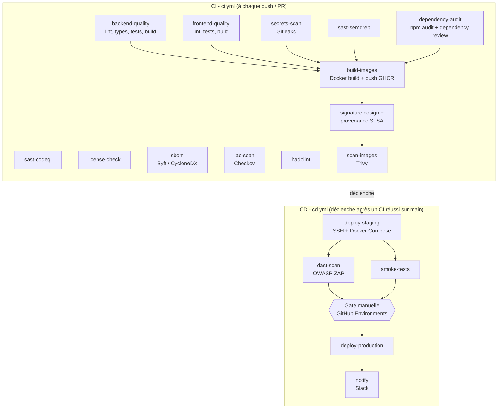

# Architecture du pipeline CI/CD

Ce document détaille chaque étape des deux workflows GitHub Actions du projet
(`ci.yml` et `cd.yml`), l'outil utilisé, ce qu'il vérifie concrètement, et pourquoi il a
sa place dans une chaîne DevSecOps bancaire. L'application elle-même (ComplianceTracker)
est volontairement simple : elle sert de véhicule pour démontrer la chaîne, qui est le
véritable sujet de ce projet.

## Vue d'ensemble

## CI - Intégration Continue (`ci.yml`)

### Qualité et tests

| Job | Outil | Ce qu'il vérifie |
|---|---|---|
| `backend-quality` | ESLint, Prettier, tsc, Jest + Supertest | Style de code, typage strict, comportement de l'API (voir `backend/tests/`) |
| `frontend-quality` | oxlint, Prettier, tsc, Vitest + Testing Library | Style de code, typage, comportement des composants React |

### Sécurité applicative (SAST) et secrets

| Job | Outil | Ce qu'il vérifie |
|---|---|---|
| `secrets-scan` | Gitleaks | Recherche de secrets (clés API, tokens, mots de passe) dans l'historique Git |
| `sast-semgrep` | Semgrep (règles OWASP Top 10, TS/JS/React) | Motifs de code vulnérables (injection, XSS, désérialisation non sûre, etc.) |
| `sast-codeql` | GitHub CodeQL | Analyse de flux de données pour détecter des vulnérabilités structurelles |

Deux moteurs SAST différents (Semgrep, basé sur des règles ; CodeQL, basé sur l'analyse de
flux) plutôt qu'un seul : ils ont des angles morts différents, une pratique courante dans
les organisations qui prennent l'AppSec au sérieux.

### Sécurité de la chaîne d'approvisionnement logicielle (supply chain)

| Job | Outil | Ce qu'il vérifie |
|---|---|---|
| `dependency-audit` | `npm audit`, GitHub Dependency Review | CVE connues dans les dépendances directes/transitives |
| `license-check` | license-checker | Licences open source incompatibles avec un usage propriétaire (copyleft fort) |
| `sbom` | Anchore Syft (format CycloneDX) | Inventaire exhaustif et signé des composants logiciels utilisés — de plus en plus exigé réglementairement (executive order US sur la supply chain logicielle, et tendance équivalente dans le secteur bancaire) |
| `build-images` (signature) | cosign (Sigstore, keyless) + attestation de provenance SLSA | Preuve cryptographique que l'image déployée provient bien de ce pipeline, sur ce commit précis, sans clé privée à gérer manuellement |

### Infrastructure as Code

| Job | Outil | Ce qu'il vérifie |
|---|---|---|
| `iac-scan` | Checkov | Mauvaises pratiques dans les Dockerfiles, `docker-compose.yml` et les manifestes Kubernetes d'exemple (`infra/k8s/`) — conteneurs root, absence de limites de ressources, etc. |
| `hadolint` | Hadolint | Bonnes pratiques d'écriture de Dockerfile (couches, cache, épinglage de versions) |

### Construction et scan d'image

| Job | Outil | Ce qu'il vérifie |
|---|---|---|
| `build-images` | Docker Buildx, GitHub Container Registry | Construit et publie les deux images (backend, frontend) uniquement sur `main` |
| `scan-images` | Trivy | Vulnérabilités connues dans l'image finale (OS + dépendances), bloque si CRITICAL/HIGH |

## CD - Déploiement Continu (`cd.yml`)

Se déclenche automatiquement quand `ci.yml` termine avec succès sur `main` (ou
manuellement via `workflow_dispatch`, notamment pour un rollback).

| Étape | Outil | Rôle |
|---|---|---|
| `deploy-staging` | SSH (appleboy/ssh-action) + Docker Compose | Déploie les images fraîchement construites sur un hôte de staging |
| `dast-scan` | OWASP ZAP (baseline scan) | Teste l'application **en fonctionnement réel** (contrairement au SAST qui lit le code source) — détecte des failles qui n'apparaissent qu'à l'exécution |
| `smoke-tests` | curl | Vérifie que les endpoints critiques répondent après déploiement |
| Gate manuelle | GitHub Environments (`production`, reviewers requis) | Aucun déploiement en production sans validation humaine explicite — configuré dans Settings → Environments, pas dans le YAML |
| `deploy-production` | SSH + Docker Compose | Déploie en production une fois la gate franchie |
| `notify` | Slack (webhook) | Notifie l'équipe du résultat, succès ou échec |

### Stratégie de rollback

Le déclencheur `workflow_dispatch` accepte un paramètre `rollback_to_sha` : redéclencher le
workflow avec le SHA d'un commit précédent redéploie l'image correspondante (déjà construite
et disponible sur le registre — les images ne sont jamais supprimées automatiquement) sans
repasser par un nouveau build.

### Alternative GitOps (non implémentée, documentée pour évolution)

Le déploiement actuel est un modèle "push" (le pipeline se connecte à l'hôte et déploie).
Une évolution vers Kubernetes utiliserait plutôt un modèle "pull" façon GitOps : le pipeline
CI mettrait seulement à jour le tag d'image dans un dépôt Git de manifestes
(`infra/k8s/*.yaml`), et un contrôleur comme **ArgoCD**, déployé dans le cluster,
détecterait le changement et l'appliquerait lui-même. Avantage : le cluster n'a jamais
besoin d'exposer d'accès entrant au pipeline CI, ce qui réduit la surface d'attaque —
un argument de sécurité pertinent en contexte bancaire.

## Secrets requis

| Secret | Utilisé par | Description |
|---|---|---|
| `STAGING_HOST`, `STAGING_SSH_USER`, `STAGING_SSH_KEY` | `deploy-staging` | Accès SSH à l'hôte de staging |
| `PROD_HOST`, `PROD_SSH_USER`, `PROD_SSH_KEY` | `deploy-production` | Accès SSH à l'hôte de production |
| `SLACK_WEBHOOK_URL` | `notify` | Webhook entrant Slack |
| `GITHUB_TOKEN` | plusieurs jobs | Fourni automatiquement par GitHub Actions, aucune action requise |

`GHCR` (GitHub Container Registry) ne nécessite pas de secret séparé : l'authentification
se fait via le `GITHUB_TOKEN` intégré, avec la permission `packages: write`.

## Ce qui est volontairement hors périmètre

- **Tests de charge** (k6, Gatling) : pertinents pour un vrai service de production, hors
  périmètre d'un projet de démonstration.
- **Canary / blue-green réel** : documenté comme axe d'évolution plutôt qu'implémenté, car
  cela suppose un load balancer ou un service mesh que ce projet ne provisionne pas.
- **Exécution réelle de ce pipeline** : ce dépôt a été rédigé et testé (lint/build/tests
  applicatifs, tous exécutés réellement) dans un environnement sans accès à Docker Hub / GHCR
  ni à un hôte de staging réel. Les jobs `build-images`, `scan-images`, `deploy-staging` et
  `deploy-production` sont donc corrects syntaxiquement (validés) mais n'ont pas pu être
  exécutés de bout en bout avant publication — à vérifier au premier push sur un vrai dépôt
  GitHub avec les secrets renseignés.
